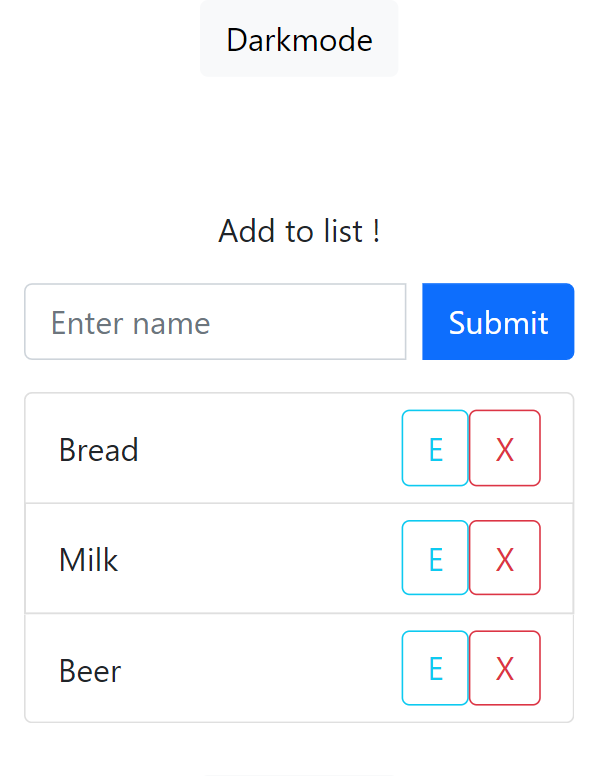

# To-Do darkmode list

Simple react Todo app utilizing a darkmode feature, adding/removing/editing items, and responsive.
## installation
- `npm install` install neccessary modules
- `npm start` run application

## Used tech
- errorhandling and display
- localStorage for persistence
- useState
- useEffect
- fetch to JSON placeholder
- refs
- javascript algorithms
- bootstrap

## Credits
- create-react-app